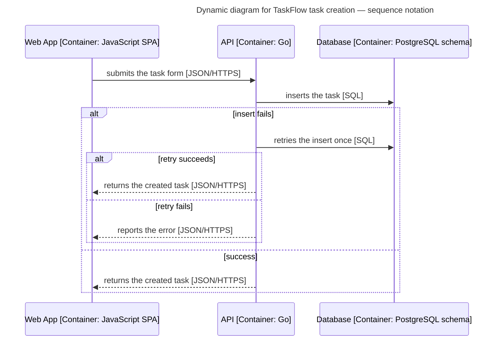
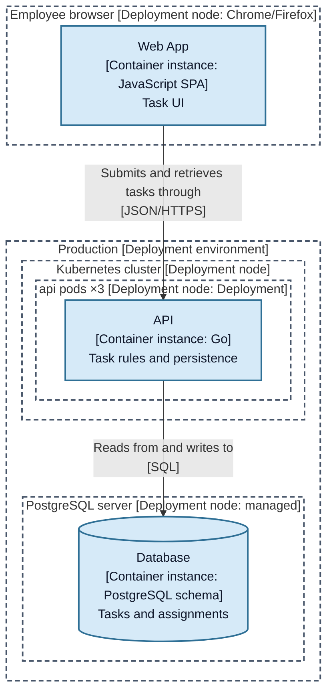
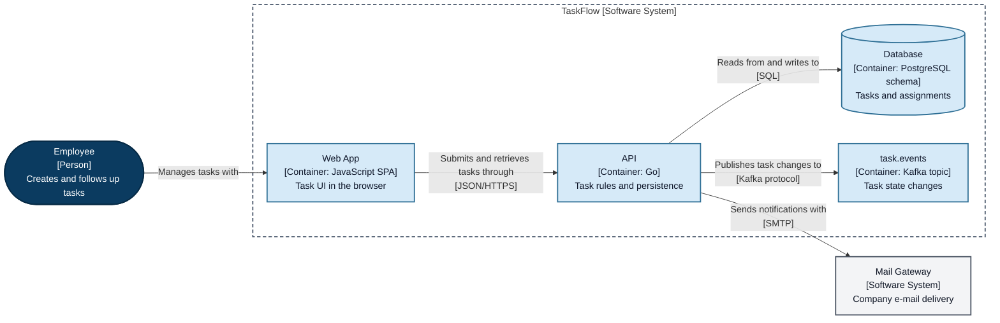

# Mermaid with C4 conventions — fallback notation

Use this mode when the target does not render C4-PlantUML, or when the user asks for Mermaid. Static views use `flowchart`; dynamic views use `sequenceDiagram`. The C4 model is officially notation-independent: the C4-ness lives in the abstractions, scopes, three-part element text, and the key — not in a keyword.

**Why `flowchart` and not Mermaid's native C4 syntax**: the C4 renderer is officially experimental, has NO layout algorithm ("the position of shapes is adjusted by changing the order in which statements are written"), no legend, and its relationship labels are drawn at fixed offsets that overlap boxes. In `flowchart`, edge labels participate in the dagre layout (they are inserted as virtual nodes), so space is reserved for them.

**GitLab version note**: GitLab's Markdown docs state Mermaid 10 while the 19.0 release notes state Mermaid 11 (both checked 2026-08-19). Treat the effective version as unknown until you render a probe block in a comment preview. On Self-Managed, a `Cross-Origin-Resource-Policy: same-site|same-origin` header makes Mermaid fail silently.

## Element text — three lines, always

```
api["API<br>[Container: Go]<br>Task rules and persistence"]
```

Line 1: canonical name. Line 2: `[C4 type: technology]` (omit the technology only for people and systems). Line 3: short responsibility. Use `<br>` — not `<br/>` — Mermaid documents `<br>` for node, edge, and subgraph labels, and GitLab normalizes variants to it.

## Shapes and palette

| C4 element | Mermaid shape |
|---|---|
| Person | stadium: `emp(["..."])` |
| Software system / container / component | rectangle: `x["..."]` |
| Data store | cylinder: `db[("...")]` |
| Queue / topic | rectangle with the type explicit: `[Container: Kafka topic]` |
| External system / infrastructure node | rectangle, `external` class |

Five stable classes — apply them consistently; the written type, shape, and boundary must keep the meaning in black and white (do not rely on color alone):

```
classDef person fill:#0b3b60,color:#ffffff,stroke:#062a45,stroke-width:2px
classDef system fill:#0f5c99,color:#ffffff,stroke:#0b416d,stroke-width:2px
classDef container fill:#d6eaf8,color:#0f172a,stroke:#2e6f95,stroke-width:2px
classDef component fill:#eef6fc,color:#0f172a,stroke:#5b8db0,stroke-width:1.5px
classDef external fill:#f3f4f6,color:#111827,stroke:#4b5563,stroke-width:2px
```

## Boundaries

Subgraphs, with the type in the title and a uniform dashed border:

```
subgraph taskflow["TaskFlow [Software System]"]
  api["API<br>[Container: Go]<br>Task rules and persistence"]
end
style taskflow fill:transparent,stroke:#475569,stroke-width:2px,stroke-dasharray:6 4
```

Connect relationships to the elements inside, never to the subgraph itself. Do not rely on `direction` inside subgraphs — Mermaid ignores it when a relationship crosses the boundary (documented limitation).

## Relationships

```
api -->|"Reads from and writes to<br>[SQL]"| db
```

First line: specific verb phrase matching the arrow direction. Second line: protocol where it applies — and never in Context/Landscape views. Solid arrows for static relationships; any extra style must be explained in the key. Consolidate parallel static relationships that express one dependency. No manual position tweaks, no invisible relationships as layout hacks.

## Direction

`flowchart LR` for Context, Container, Component; `flowchart TB` for Landscape and Deployment. Switch to TB when a wide fan-out makes LR too wide.

## Dynamic views — sequenceDiagram

All dynamic views use `sequenceDiagram` (retries, loops, alt/else, and repeated exchanges are first-class). Participants reuse canonical names with the C4 type in the label; participant boxes carry identity only — state every participant's responsibility in the same Markdown unit (intro text or a compact table). Keep protocols on the relevant messages, responses included; dashed arrow = response. The key explains lifelines, activation, and `alt` frames.



## Deployment views

Nested subgraphs are the deployment nodes; instances are leaf nodes; one diagram per environment; reuse the static model's names; show replica counts when confirmed; DNS/load balancers/firewalls are infrastructure nodes (external class), never fake containers.



## Complete example — Container view as delivered

````markdown
## Container diagram for TaskFlow

The applications and data stores inside TaskFlow, and how they communicate.



### Key

| Notation | Meaning |
|---|---|
| Stadium (dark blue) | Person: human role that interacts with the system |
| Light blue box in the dashed frame | Container: application or data store of TaskFlow |
| Cylinder | Data container |
| Gray box | External system, out of scope |
| Dashed frame | Boundary of the system in scope |
| Arrow | Directed relationship, labeled from the initiator; protocol shown where applicable |

### Acronyms

| Acronym | Meaning |
|---|---|
| API | Application Programming Interface |
| UI | User Interface |
| SPA | Single-page application |
| JSON | JavaScript Object Notation |
| HTTPS | Hypertext Transfer Protocol Secure |
| SQL | Structured Query Language (database access) |
| SMTP | Simple Mail Transfer Protocol |

### Scope and assumptions

- Conceptual example; represents the current architecture of the fictional TaskFlow.
````

Context/Landscape/Component views follow the same conventions (Context and Landscape drop protocols; a Component view scopes one container as the subgraph). In real output, EVERY diagram ships as a full Markdown unit per the output contract.

## Mermaid native C4 syntax — review-only knowledge

Never generate it. When reviewing or converting existing documents that use it, know these verified facts (checked against the Mermaid source, 2026-08-19):

1. `C4Dynamic` auto-numbers every relationship in declaration order (`rel.label.text = i + ': ' + text`) — manually numbered labels render double ("1: 1. text").
2. In every C4 type, a repeated directed pair silently REPLACES the previous relationship (`rels.find(from,to)` → update, not push) — flows lose steps.
3. There is no legend keyword, no automatic layout, no C4 code-level or landscape type.

Converting such documents to this file's conventions (or to C4-PlantUML) is the fix for label overlaps and lost steps.
